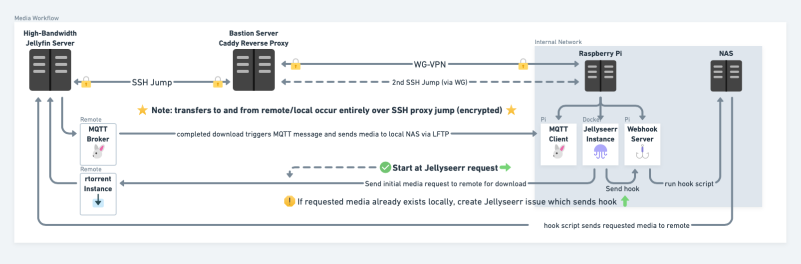

<h1 align="center">
  Hello! 👋
</h1>

This repository is the home for my Media Workflow documentation, meant to describe the process by which media is requested and moved between a local and remote media server.

## Table of Contents
- [Table of Contents](#table-of-contents)
- [About The Project](#about-the-project)
- [Notes/To do](#notesto-do)
- [Outline of Workflow](#outline-of-workflow)

## About The Project

The goal of this project is to document the separate components which make up the whole media workflow. Since each component solves a specific problem, I think it makes sense for each to be housed in their own repository with this documentation repository providing a holistic view of the whole process.

This project is part of the broader [Infrastructure Documentation](https://github.com/chase-slept/infra-doc) project--please check it out if you're interested.

## Notes/To do

- Create write-up or README for media workflow
- Create/Tie in other repos/projects:
  - LFTP script x2
  - MQTT script and documentation
  - Webhook documentation
  - ~~sync-script~~

## Outline of Workflow

more documentation pending ...
